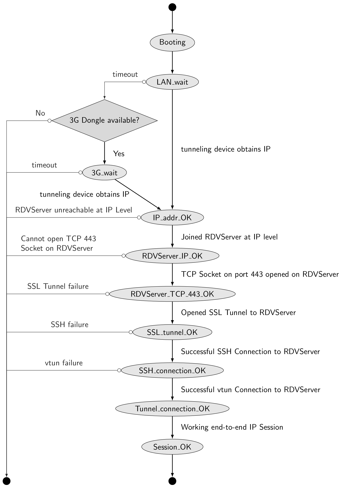

# Software architecture

## Goals

This documentation gives a high level overview of the software architecture that is built to implement the remote access framework.

This project uses vtun as a tunnelling tool on both RDV server and tunnelling devices. A library has been setup in order to control vtun from Python, it is used both on the RDV server python code and on the tunnelling devices python code. This library (pythonvtunlib) is available [in a separate git repository](../../../pythonvtunlib/).

The software required to build a RDV server is published in this repository.

The software required to run on tunnelling devices (onsite or master) is published [in a separate repository](../../../remote-access-tunnelling-dev/).

## Physical machines & devices included in the project

There are several typologies of machines/devices that take part during a remote access session. They play different role and are listed below:

* The *RDV server* (a public Internet facing service)
* The *Master Raspberry Pi* (referred to as *master RPI* in the rest of this litterature)
* The *Onsite Raspberry Pi* (referred to as *onsite RPI* in the rest of this litterature)

Note that master and onsite devices have a lot in common, and when differentiating between them is not relevant, we will use the term tunnelling device (meaning either onsite or master device).

The *RDV server* is the core engine of the remote access solution: it allows interconnecting onsite and master devices in order to provide access from the support network (master) to the customer network (onsite).

The RDV server is an Internet-facing M2M service, reachable over the public Internet. This service has been designed to run on a Linux-based machine (running Debian, but other commonly used distros should also work). It can run on a physical device or hosted by a provider.

The onsite RPI plays a dedicated role called "onsite tunnelling device". Its aim is to connect to the RDV Server and then wait for an external request, making itself available for a remote access session. On current implementations, it runs on Raspberry Pi devices, running Raspbian OS.

The master RPI plays a dedicated role called "master tunnelling device'. It connects to the RDV Server with the aim to initiate a remote access session to an onsite RPI.
For this purpose, it will allow listing currently online onsite devices, then select one onsite device and establish a remote access session. On current implementations, it also runs on Raspberry Pi devices, running Raspbian OS.

# Detailed architecture

The 3 types of roles detailed above (RDV server, onsite and master tunnelling device) take part in a distributed software architecture illustrated below, each being represented by a black rectangle.
Each tunnelling devices exchange data with RDV server using an ssh session.

## Tunnelling devices shell

Once connected to the RDV server using ssh, a tunnelling device will get a restricted shell (called tundev-shell). This shell allows the tunnelling device to interact with the RDV server.
The commands entered by the tunnelling device inside this shell are fully automated (using the Python library pexpect), but one could also manually interact with this shell from a terminal if needed.

The tundev-shell is a command-line interpreter running on the RDV server. It is via this shell that all tunnelling devs exchange information with the RDV server.

This shell is running on the RDV server, it is slightly different depending on whether the connection comes from a onsite or master tunnelling device).
This shell is implemented in python, its implementation can be found in [masterdev_shell.py](masterdev_shell.py) and [onsitedev_shell.py](onsitedev_shell.py) for master and onsite tunnelling devices respectively.

## Session

In the rest of the documentation, we will use the term "end-to-end session" to designate a pair of vtun tunnels interconnected and routed by the RDV server:
* one vtun tunnel being setup between the onsite device and the RDV server
* and the other one between the master device and the same RDV server.

## Software running on the onsite tunnelling device

As shown in the above picture, the required software running on the onsite tunnelling device consists of:

* The python script onsitedev_script.py
* The bash script onsitedev_script.sh
* The daemon onsitedevscript
* The python script onsitedev_script.py

### onsitedev_script.py

This python script is the most important part of the software (domain) running on the onsite tunnelling device .
That script processes the connection to the RDV server using SSH (inside an SSL tunnel if command line option -T is used)

It executes a set of commands to notify the RDV server about its availability and characteristics (IP adressing, hostname).

This script is an implementation of the following state machine:

The SSH connection to the RDV server is performed using public-key authentication, using with a pre-defined user account that has to be setup on the RDV server beforehand.
This user account does not present a standard shell, but a restricted shell named onsitedev_shell.

Once logged into the onsitedev_shell, the onsite device provides mandatory information to the RDV server (such as its local IP address) and waits for a master to select it for a remote access session.

When a master selects this device, the onsite device will setup the vtun tunnel in the desired mode (Level 2 or Level 3) using characteristics and adressing provided by the RDV server and will then wait until the tunnel drops or until the master ends the session.

### The bash script onsitedev_script.sh

To ensure that the onsite device is always retrying to set up a session when no master selected it, we execute the python script onsitedev_script.py in an infinite loop, performed inside onsitedev_script.sh.

This script is mainly launches the python script and wait until it ends before trying to launch this script again.

When onsitedev_script.sh is run, we also store its pid is stored in a PID file. By this way, we can stop the infinite loop by using /etc/init.d/onsitedevscript stop.

### The init script onsitedevscript

This init script is run at boot time on automatic onsite devices, so that they are setting up their tunnels automatically without any user intervention (see this article for details)

## Software running on the master tunnelling device

### masterdev_script.py

Similarly to onsite devices, this python script is the most important part of the software (domain) running on the master device .
That script processes the connection to the RDV server using SSH (inside an SSL tunnel if command line option -T is used)

This script is very similar to the onsite python script, with the following differences though:

* The master will list and selects an onsite device, and is this the initiator of the remote access session
* The default shell associated with master accounts it a masterdev_shell
* The master shell allows to select the vtun tunnel mode (Level 2 or Level 3) for the session.
* This script does start automatically at boot on master RaspberryPi.
  It is currently launched from command line (so the remote support terminal needs to connect to the master device via ssh and run the script manually).

### The python script master-secondary-if-watcher.py

This script continuously monitors inserting/removal of USB to Ethernet adapters and updates the description of the master secondary (to remote-terminal) network interface accordingly.

It also configures the IP addressing of these secondary interfaces, and enables DHCP service on them.

### The init script ifwatcher

This init script is run at boot time on automatic launch master-secondary-if-watcher.py

## Software running on the RDV server

There are 4 software modules running on the RDV server:

* vtun_manager.py
* vtunmanager
* onsitedev_shell.py
* masterdev_shell.py
* The python script vtun_manager.py

### vtun_manager.py

This python script is a process that references the connected tunneling devices and the established sessions.
It also applies the configuration (routing, bridging, NAT) required to link the two tunnels between both tunneling devices (onsite and master). For this reason, it should be run with sufficient privileges (this is often achieved by running it as root).

It interacts with the tundev shell over DBus allowing isolation of code and access rights.

### The init script vtunmanager daemon

The vtunmanager daemon is a software that ensure the vtun_manager.py script is launched on startup of the RDVServer.

### The python CLI onsitedev_shell.py

The onsitedev_shell.py is the default shell executed upon an onsite SSH connection. It provides a command-line interface to the onsite tunnelling devices.

This script interfaces with vtun_manager.py using DBus methods, for example to manager ther vtun tunnels to the remote tunnelling device.

###  The python CLI masterdev_shell.py

The masterdev_shell.py is the default shell executed upon a master SSH connection. It provides a command-line interface to the master tunneling devices. It manages the Vtun tunnels that are mandatory for the session to be alive (starting of stopping of tunnels).

This script interfaces with vtun_manager.py using DBus methods, for example to manage ther vtun tunnels to the remote tunnelling device.

 