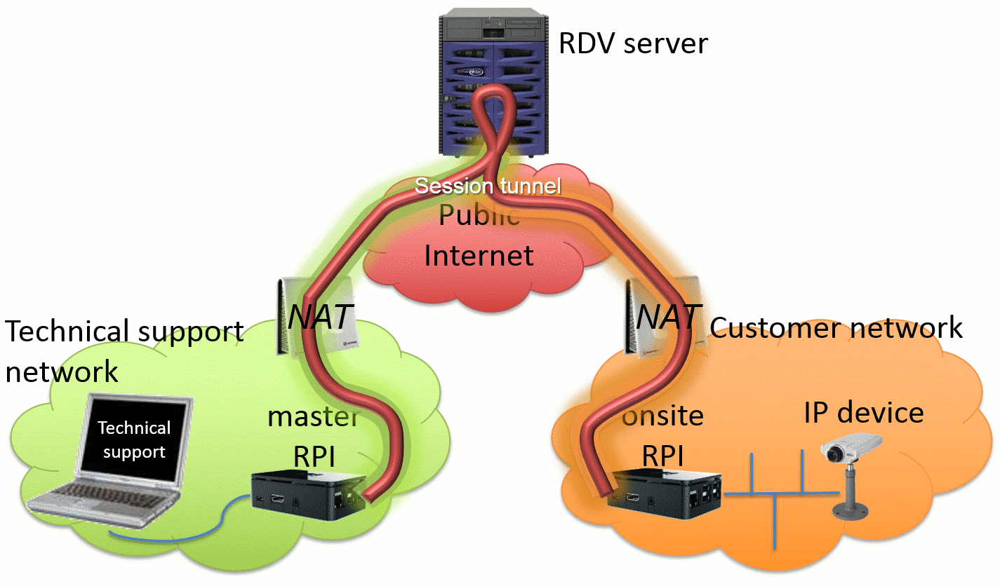

This repository contains the source code for the server part of the remote access project.
It also contains the general documentation for the whole framework (see below).

# Disclaimer

This remote access framework has been designed to get access to remotely installed devices, either setup at a customer premises or on a remotely connected LAN.
Use of this code is at your own risk, please consult the license file for the terms and conditions.

# Introduction

This part documents the remote access framework. Initially designed early 2015 within Legrand, this framework allows to provide a direct access to devices remotely installed.

This prototype allows a user to remotely access an onsite device as if we were directy connected to it (and going trough NATs and most firewall to create a covert IP channel using vtun).

It has been implemented using two physical devices (Raspberry Pi, also referred to as RPI below) at each end of the channel (one for the operator, one connected to the remote LAN, usually connected to the customer premises).

The following drawing gives an overview of the components as well as the network relationships between the components of this framework:


# Physical machines & devices included in the project

There are several typologies of machines/devices that take part during a remote access session. They play different role and are listed below:

* The *RDV server* (a public Internet facing service)
* The *Master Raspberry Pi* (referred to as *master RPI* in the rest of this litterature)
* The *Onsite Raspberry Pi* (referred to as *onsite RPI* in the rest of this litterature)

Note that master and onsite devices have a lot in common, and when differentiating between them is not relevant, we will use the term tunnelling device (meaning either onsite or master device).

The *RDV server* is the core engine of the remote access solution: it allows interconnecting onsite and master devices in order to provide access from the support network (master) to the customer network (onsite).

The RDV server is an Internet-facing M2M service, reachable over the public Internet. This service has been designed to run on a Linux-based machine (running Debian, but other commonly used distros should also work). It can run on a physical device or hosted by a provider.

The onsite RPI plays a dedicated role called "onsite tunnelling device". Its aim is to connect to the RDV Server and then wait for an external request, making itself available for a remote access session. On current implementations, it runs on Raspberry Pi devices, running Raspbian OS.

The master RPI plays a dedicated role called "master tunnelling device'. It connects to the RDV Server with the aim to initiate a remote access session to an onsite RPI.
For this purpose, it will allow listing currently online onsite devices, then select one onsite device and establish a remote access session. On current implementations, it also runs on Raspberry Pi devices, running Raspbian OS.

# How to install a remote access service

See the [dedicated documentation](INSTALL.md)

# How to setup remote access tunnelling devices

See the [dedicated documentation](../tunnelling-dev-scripts/INSTALL.md)

# Using the remote session

This section explains how to use the remote access framework to remotely connect from a master device to an onsite device.

## Prerequisites

The following elements are required before a the remote access session can be setup:
* you will need to setup a RDV server on a publicly accessible (on TCP port 443) machine, and have it up and running. See the [related documentation](INSTALL.md).
* you will then need to [setup at least one onsite Raspberry Pi and one master Raspberry Pi using the tutorial](../tunnelling-dev-scripts/INSTALL.md). The RDV server's IP address must be configured correctly on both onsite and master devices.
* two accounts must be created on the RDV server, for both onsite and master devices
* onsite and master devices must have generated public/private ssh keypairs and the public keys must have been enabled as a public key authentication to associated accounts created on the RDV server
* the configured onsite device can now be shipped to the remote location, powered up, and connected to a network that has access to the public Internet
* you must know the identifier (account) of the onsite device on which you want to connect to from your master device (following the template "rpixxxx")

## Setting up the remote access session

Nothing is required on the onsite device (if it is configured properly, it will connect to the RDV server as soon as at it boots - this can be checked on the RDV server's logs (`/var/log/vtun_manager.log`).

1. Power up the master device, and plug into that device the USB side of a USB to Ethernet adapter (note: only one adapter should be connected to the master at any time).

2. Plug the remote support personnel's machine to the Ethernet port of the USB to Ethernet adapter.
   The link should go up, and IP address will be automatically distributed to the support machine (by default, it will have an IP address in the 192.168.38.224/29 range).

3. Currently (at the prototype stage), there is no graphical interface on the master Raspberry Pi to control the session, so you will need to perform some command-line manipulation.
   From the remote support machine, open an ssh connection to the master device (its IP address can be retrieved by looking at the DHCP server or default gateway setup on the support machine, by default this address is 192.168.38.225).
   If this succeeds, directly move to the next step (4.), otherwise, please read on.

   Note: If avahi-server has been enabled on the raspberry, you can also use Bonjour/Avahi/mDNS.
   In any case, executing tcpdump/wireshark to get the IP address of the Raspberry.
   This is the only way to get the IP address of the Rapsberry if no USB to Ethernet adapter is used (it will not be reachable using 192.168.38.225)

   Warning: Currently, the detection of the extremity interface (secondary USB to Ethernet network adapter) is supported after boot.
   This will make the RPI distribute IP addresses to support machines, on this secondary interface (referred to as 'extremity interface" in the code).
   Make sure to plug the USB to Ethernet adapter only after the RPI has booted, and before the masterdev_script.py command is launched below.
   If the USB to Ethernet adapter is plugged in only after `masterdev_script.py` is run, the script will not NAT to that interface, and remote access won't work properly ie the name of the extremity interface will then be eth0, this can be detected by checking the extremity interface displayed when debug (-d) mode option is set when running `masterdev_script.py`.

4. On the ssh connection, type in the credentials for the master Raspberry Pi (by default pi/raspberry)

5. Once you get a shell on the master, move to the directory containing the master scripts:
   ```
   cd tunnelling-dev-scripts
   ```

6. On the master ssh terminal, list the currently connected onsite devices, by typing:
   ```
   ./masterdev_script.py -T -l
   ```
   You should see your onsite device listed, if not, please check the RDV server logs and make sure prerequisites (above) for onsite device are fullfilled

7. Now, open a remote access session to the onsite device
   ```
   ./masterdev_script.py -T -o rpixxxx
   ```
   Note: In case the script above fails, you can run it again in debug mode by adding `-d` to the command line arguments.

## Using the remote access session

### Standard use with a secondary network adapter on the master RPI

#### Accessing the remote onsite RPI

Using a secondary USB Interface, if the master is properly configured, any machine connected on that secondary interface will get an IP address as well as a default gateway (matching with the master RPI).

From that machine, once the session with the onsite is established, on the master's terminal you should see a message indicating that the session has started together information about the onsite RPI's LAN IP address.

Keep the terminal open for the whole duration of the session.

From the machine connected on the Ethernet to USB adapter, you should then be able to ping that IP address (remote onsite RPI) and even ssh to the remote onsite RPI using that IP address. This allows install and run scripts directly on the onsite device for example to run a network capture.

The IP address of the onsite RPI can also be used for file transfers to/from the onsite RPI using scp for example.

#### Accessing any machine on the remote onsite LAN

Once you have made sure you can read the remote onsite RPI, you can now access devices on the customer LAN by directly using their IP address for web, telnet, ssh connections, TCP, UDP connections, or for ping, traceroute etc.

Congratulation, you have successfully setup the full remote access session!

Note: By default, the DNS configuration from the onsite device is not propagated to the support machine, which will use the *master device DNS servers*. If you need to use the onsite LAN to resolve DNS requests, you will need to manually configure the DNS server list of the support machine to match the ones provided in the feedback of the onsite device.

Warning: The master RPI itself has no host route to the remote onsite LAN so pings to remote onsite machines (or even to the remote onsite LAN's IP address won't work, but this does not mean that the connection is broken).
At most, it will be possible to ping the remote IP address of the tunnel to the onsite, but not the onsite LAN.
This is because the remote access system uses a non-OS-default routing table, which is not the kernel default routing table that is used when issueing commands like ping, traceroute. This can be tricky if unknown when diagnosis.
This specific routing table is setup inside the tundev_script.py code, it is called "table 1" in the ip command and sonly paquets coming from the USB/Ethernet adapter use this table #1
When troubleshooting, thus, ping cannot be used, but routing table #1 can be double-checked using the following command on the master RPI:
```
ip route show table 1
```

### Manual way (for experts only)

Take a machine on the same LAN (same subnet) as the master RPI. It will serve as the remote support machine (we usually employ a virtual machine for this purpose)

Check that you can ping the master Raspberry from the remote support machine:
```
ping <master_IP>
```
If that's the case, change the IP configuration on the remote support machine so that its default gateway is the master Raspberry.

Under Linux:
```
sudo route del default gw <old_gateway>
sudo route add default gw <master_IP>
```
Or under Windows, change the Network parameters/Network Center in the Control Panel to force a default gateway.

Because the default route is going through the onsite network connection, DNS resolution will probably fail once the default gateway has been changed.

You will need to manually specify the DNS server to be the one of the customer network (see the Raspberry's file /etc/resolv.conf to find this out) or to point to a public DNS, for example Google's one: 8.8.8.8

On the remote support machine, it is necessary to adjust the MTU of the network interface connected to the master device. Set the value to something like 1400 (there is a bit less than 100 bytes taken by the stunnel, vtun, IP, TCP overhead).

Under Linux:
```
ifconfig <network_interface> mtu 1400 up
```
Under Windows, you will need to use the netsh CLI command (see this [link)](http://www.richard-slater.co.uk/archives/2009/10/23/change-your-mtu-under-vista-windows-7-or-windows-8/).

Now all you traffic goes via the master RPI, you won't have access to your local network anymore, all traffic will go through the tunnel (this is the reason why we use a virtual machine in bridge network mode... so that the host still has access to the LAN)

You can now continue the process by following [the instructions above](#standard-use-with-a-secondary-network-adapter-on-the-master-rpi).

## Stopping the remote access session

In order to disconnect from the onsite, just type [Control]+[C] on the master ssh terminal.

Note: Unplugging the USB to Ethernet adapter, or bringing the Ethernet link down on the USB to Ethernet adapter will also make the mastet device drop the remote access session.

# Outstanding issues & features wishlist

The section below lists outstanding issues/features on this code:
- Possible issue, to reproduce:
  tundev shell blocks on get_vtun_parameters
  This is random, but running many times the tundev-side scripts, we sometimes get a ConnectionFrozen exception from the tundev script, after a previous connection that was successful.
  This comes from tundev shell that blocks on get_vtun_parameters (no ouput, no prompt reappears, the shell is hung).
  When this happens, we can observe the following logs in /var/log/daemon.log on the RDV server:
  Apr 8 12:41:09 RDVServerVM vtund[24913]: /remote-access/rdv-server-tundev-shell/blob/master/VTUN server ver 3.X 03/25/2015 (stand) (it seems there is no line mentionning the self TCP connection log that we usually have from the internal python vtun library)
  After the script disconnects, connections do not work anymore. If we /etc/init.d/vtunmanager restart, this does not solve the pb. We have a remaining vtund on TCP localhost:5000 (shown by lsof -i) The only way to get rid of the failure is to kill the vtund and /etc/init.d/vtunmanager restart

- Rename vtun_manager.py to rdv_engine.py?

- Finish to remove the concept of username in vtun_manager.py (and replace it with something more generic, for example tundev_id)
  Even if, at the end of the day, tundev_id will indeed match with the username, the concept of username should only be used in tundev_shell's code

- Allow segregation of onsite depending on master (access control)
  All master can connect to all onsite. If the system is deployed to many customers and there are several people using master devices, it would be good not to give access to all onsite devs. When calling the tundev shell command show_online_onsite_devs, only authorized onsite devs would be displayed When issuing the connect_to_onsite_dev from command a master dev, only authorized onsite devs would be accepted
  Mapping between onsite and master could be done in a text file (XML, JSON) outside of the source code.

- Add DNS forwarding from onsite to master
  onsite gets the DNS config via DHCP, it should transfer this config to the DNS servers provided via dnsmasq
  onsite devices currently communicate their DNS settings to the RDV server when creating the tunnel RDV server would then give the DNS config to the master when selecting a specific onsite
  Today, on master, dnsmasq announces itself as the DNS, and forwards requests to the master LAN (eth0) but not the onsite LAN
  To remove DNS resolution by the master on the LAN, we need to get rid of the DNS relay function of DNSmasq and provide the onsite's DNS config via DHCP

- Removing test D-Bus method ConfigureService from vtun_manager.py
  Access to configure service via TundevVtunDBusService's ConfigureService() D-Bus method should not be allowed, only direct method invokation of TundevVtunDBusService.configure_service() inherited from TundevVtun

- On PythonVtunLib, improve server-side tunnel management
  On the server side of vtun, there are 2 items:
  * the vtund deamon: it listen to a specific port, and initialize server side of tunnels,
  * the server side of a tunnel: it is the server part of a tunnel that matches a session in the vtund deamon configuration file.
  Currently, there is one deamon for each tunnel. It might not be the best pratice since it uses a port for each tunnel.
  Future improved version of the framework could thus implements a way to keep only one deamon for all tunnels, since the deamon can reload its configuration file, there should be a way to add/remove tunnels, regenerate configuration file and tell the deamon to reload this file.